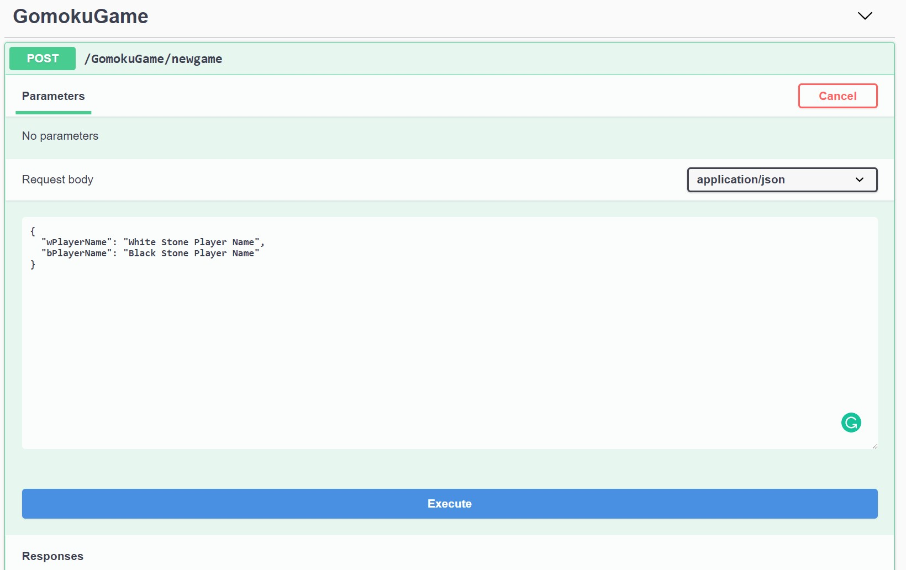
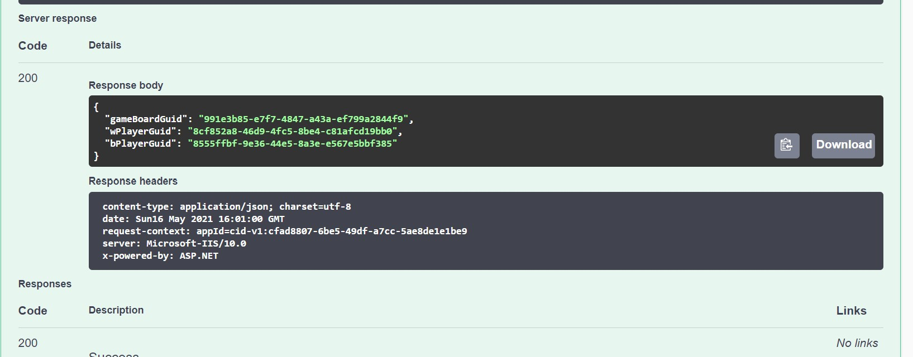

## README

### Running the code

* After checking out the the source code from the `develop` branch, go to `KennardHireGomokuApi` to open the solution in Visual Studio 2019.
* From VS2019, you should be able to build and run the solution, and SwaggerUI page opens up for `KennardHireGomokuApi` project.
* There are 4 projects. One of it is Unit Tests for the `KennardHireGomokuApi` project
* The complete developed solution is in `KennardHireGomokuApi` project.
* The remaining two projects (`KennardHireGomokuClient` and `KennardHireGomokuConsoleApp`) are not completed but parked in the solution for further development.
* Alternative, you can build and run test in command prompt with the following `dotnet clean;dotnet build;dotnet test`

* The Service and the dependenies classes are covered with unit tests.

### How to use the App

* When running the App locally, with Swagger UI, you would have to create the game,as a request, as shown in the screenshot below.

You should be receiving a reponse as the following screenshot:

The information in the response is used to send the stones location on the gameboard.

