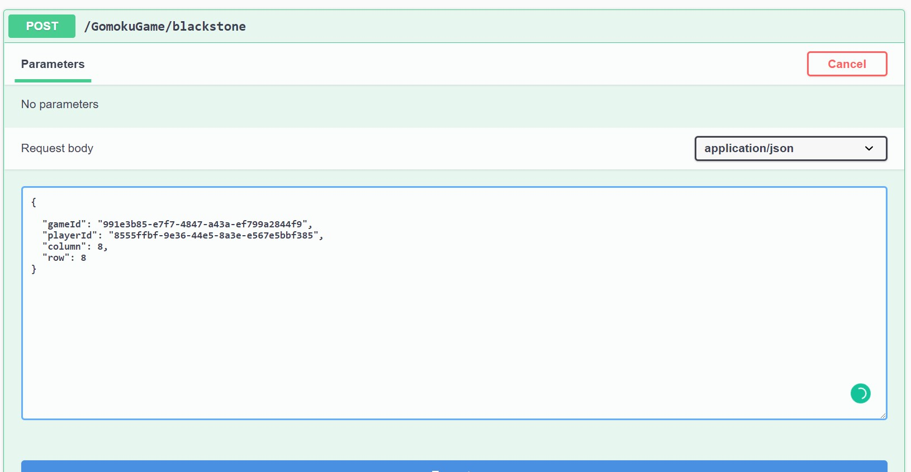
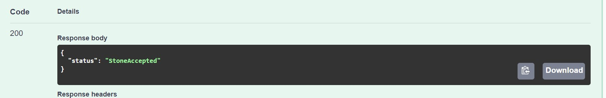
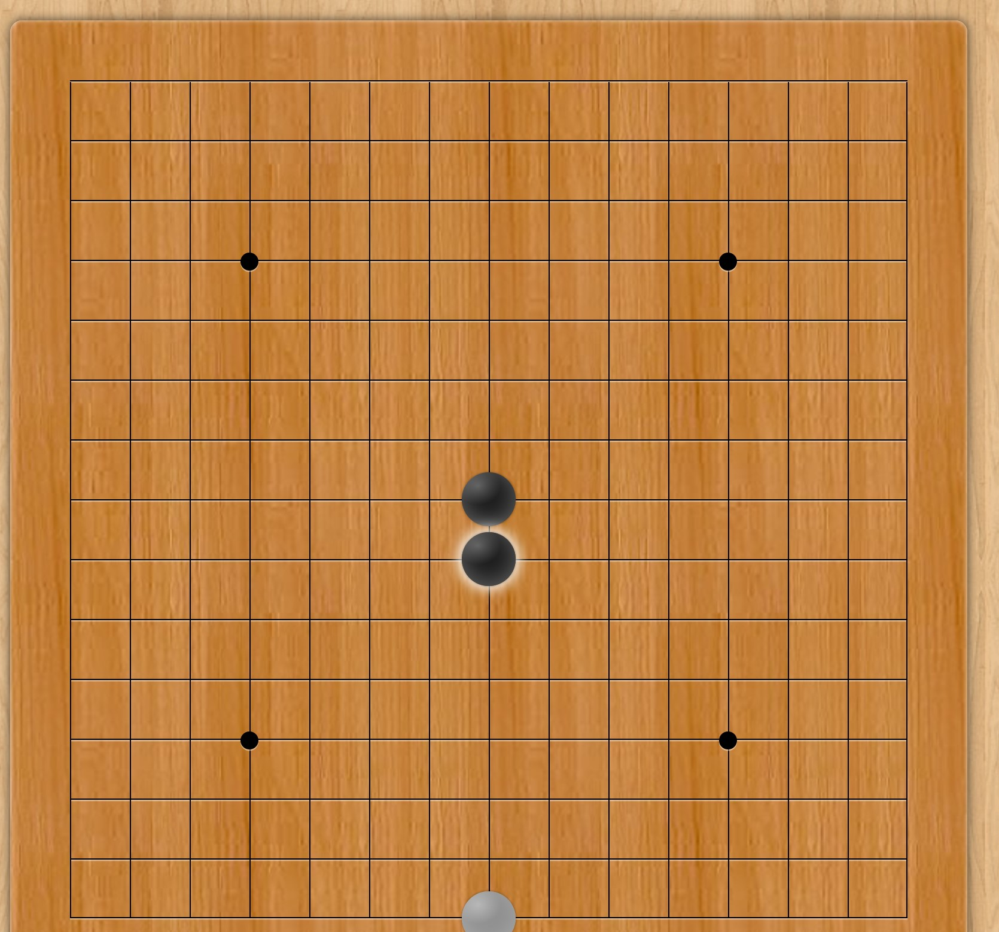
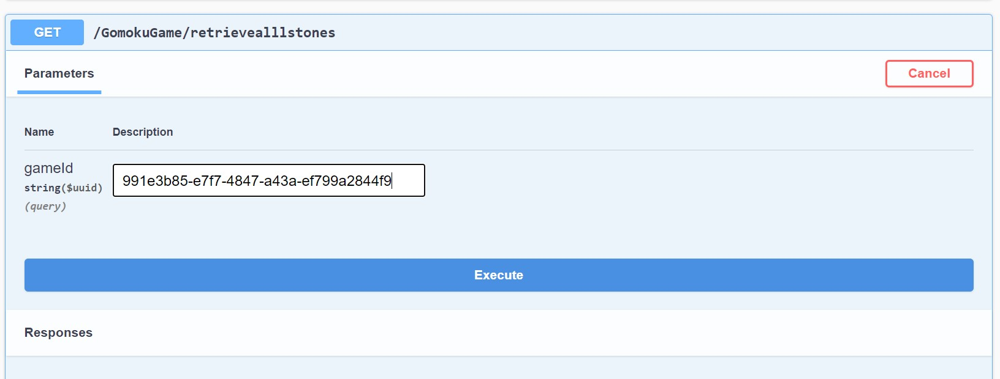
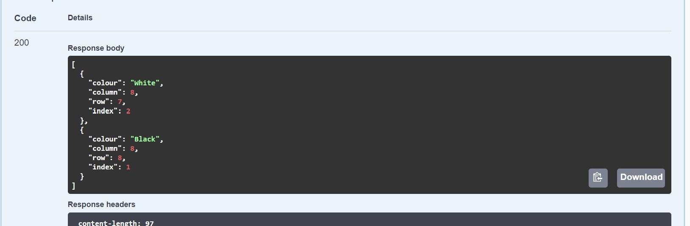
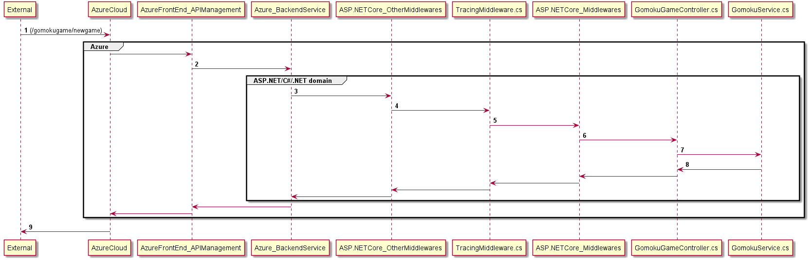
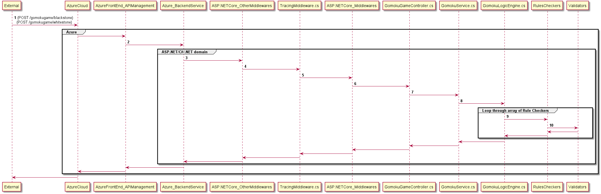
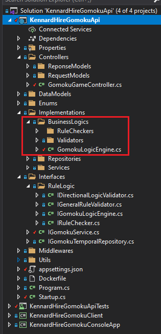
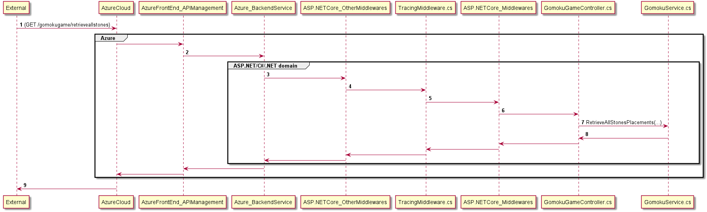

## README

### Running the code

* After checking out the the source code from the `develop` branch, go to `KennardHireGomokuApi` to open the solution in Visual Studio 2019.
* From VS2019, you should be able to build and run the solution, and SwaggerUI page opens up for `KennardHireGomokuApi` project.
* There are 4 projects. One of it is Unit Tests for the `KennardHireGomokuApi` project
* The complete developed solution is in `KennardHireGomokuApi` project.
* The remaining two projects (`KennardHireGomokuClient` and `KennardHireGomokuConsoleApp`) are not completed but parked in the solution for further development.
* Alternative, you can build and run test in command prompt with the following `dotnet clean;dotnet build;dotnet test`

* The Service and the dependenies classes are covered with unit tests.

#### API calls in Azure

New Game
POST https://kennardhiregomokuapimgt.azure-api.net/GomokuGame/newgame
* refer to description below on pushing the request payload

Place BlackStone
POST https://kennardhiregomokuapimgt.azure-api.net/GomokuGame/blackstone
* refer to description below on pushing the request payload

Place Whitetone
POST https://kennardhiregomokuapimgt.azure-api.net/GomokuGame/whitestone
* refer to description below on pushing the request payload

Get All Stones information for the Game
GET https://kennardhiregomokuapimgt.azure-api.net/GomokuGame/retrievealllstones?gameId={GAMEGUID}
* refer to description below on pushing the request payload
#### Source Code:
* I used GitFlow pattern to branching out of master and working on develop branch
### How to use the App

* When running the App locally, with Swagger UI, you would have to create the game,as a request, as shown in the screenshot below.

You should be receiving a reponse as the following screenshot:

The information in the response is used to send the stones location on the gameboard.

** NOTE: Black Stone Player always start first. The Game is default for the Black Stone Player to start first with the game is created.

* When the player sends the black stone location, the player is to use the `gomokugame/blackstone` api as shown in the screenshot below:

The `gameid` field should be populated with the `gameBoardGuid` from the response when the game was created
The `playerId` field should be populated with the `bPlayerGuid` from the response when the game was created

This is needed for verification that the right player of the game is assigning the coordinates for the black stone.
If the player is invalid for the game, the app will provide `IncorrectPlayer` status in the response.

For a successful `POST`, you will receive the following response:

When the app receives the request, it checks that the right player is sending the request for the game and so the location provided is not pre-occupied by an existing stone. Hence, the app will provide `ProposedStoneLocationOccupied` status in the reponse.

From the provided stone, if the 5 same colored stones are aligned in any 8 directions (North, South, East, West, North-East, North-West, South-East and South-West) of the stone, then the app will provide `BlackWon` or `WhiteWon` status in the response. 

The stone's location range is from 1 to 15 in x and y axis where the the buttom left hand corner of the board is (1,1) and the top right hand corner is (15, 15). Any coordinates ourside this range, fed to the app, will be rejected (`StoneRejected` response). 

* This is same approach as above-mentioned `POST` call when posting white stone. However, you have to use `gomokugame/whitestone` api to post the request. You to ensure that white player Guid is used when posting your request.

You will get the same type of response as `gomokugame/blackstone` api as mentioned above.

* You can also request for all the stones information for the game from GET call on `gomokugame/retrieveallstones` api as shown on the screenshot below.

You have to pass the gameguid as query string  for the gameid query parameter.

You should be receiving an array of stones location and their index field represents the order the stone information is received as shown in the screenshot below:

## Technical Details

### Sequence Diagrams

#### On (GomokuGame/newgame) api

* when the POST call was received as indicated in bold label **1**, this payload is carried all the way to the service layer to create a new game and store it in a dictionary with its GUID as it's key.

* game's, white player's and black player's guid is returned as response.

#### On (GomokuGame/blackstone) and (GomokuGame/whitestone) api

* Both the `POST` calls follow the similiar path. 
* Focusing on the complex in the above sequence diagram is in the `loop through rule checker and validators`. below is the screenshot of the source code structure organisation.

* The checks and validations of the rules against the incoming stone resides in the folders boxed in red.
* It is the challenging component of the assignment to determine breaking down the rules of the games with SOLID principles.

#### On (GomokuGame/retrieveallstones) api

* This is a simple path where the service layer labeled **7** does the consolidation of the stones for the requested game

### Thought Process to the Challenge.

* I spent considerable amount of time planning and have to continuously check with the plan for further adjustments as I work through the challenging layers of the problem.
* My initial idea was to develop the api web service, host the service up in Azure and build a Console App to talk to the hosted APIs.
* To this point, only the Api Service is done and hosted. I was not able to complete or start on the Console App. Hence, The app service needs to be verified manually by POSTMan app.
* section the challenge into three parts.
    * App Deployment in Azure
    * the Development
    * Unit  and Manual Testing

## Overall
* Interesting Challenge
* I learnt a lot from the Challenge.
* I would like to improve this project in my own time.

## Areas I would like to improve on if I revisit this challenge.
* More loggings and try-catch statements.
* More tests around the game logics.
* performance testing.
* add UI for the App, perhaps React.
* Automation Testing after UI is done.
* I need to put lock around the game dictionary to prevent simultaneous read-write.
* Improve on Swagger documentation on the Apis. Need to get Swagger UI working in Azure.
* Complete the Console App.
* Look into AI algorithm for the game.
* Adding DB support to record historical Data.
* look into a seperate microservice to prepare results in PDF files with iText library.